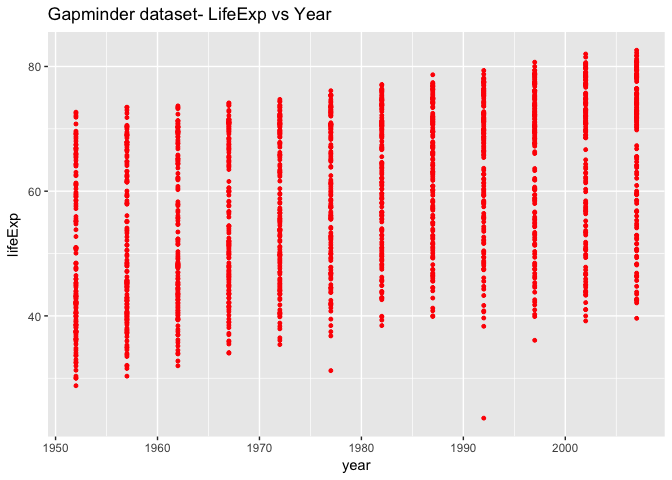
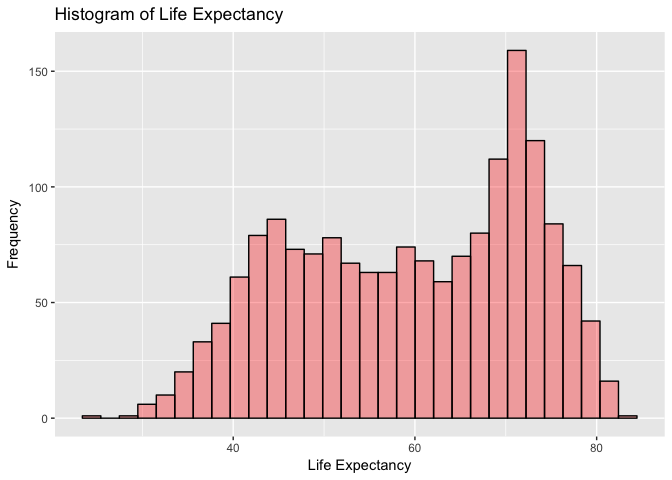
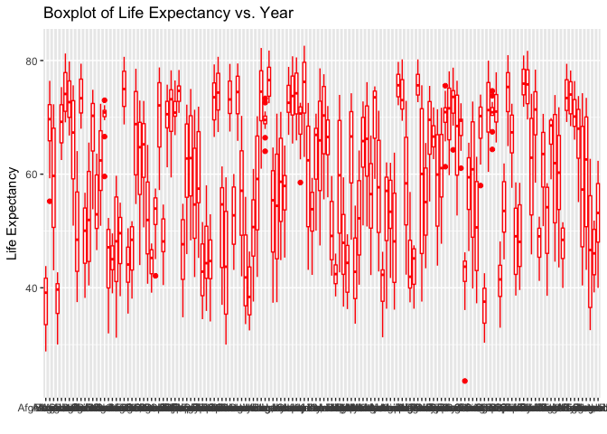
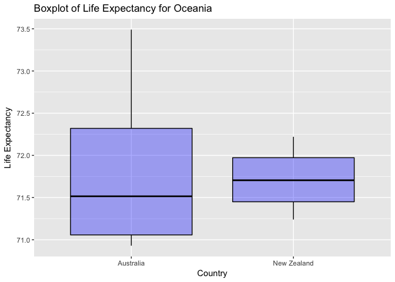

# Questions to HW2
Nathan Bendriem  
September 24, 2017  


```r
library(gapminder)
```

```r
library(tidyverse)
```

```
## Loading tidyverse: ggplot2
## Loading tidyverse: tibble
## Loading tidyverse: tidyr
## Loading tidyverse: readr
## Loading tidyverse: purrr
## Loading tidyverse: dplyr
```

```
## Conflicts with tidy packages ----------------------------------------------
```

```
## filter(): dplyr, stats
## lag():    dplyr, stats
```

# Homework 2:

Exploring the Gapminder dataset by using dplyr and ggplot2.  This page will contain the answers to the given questions as well as the codes and functions I used.

# Explore the Gapminder object:

## Is it a data.frame, a matrix, a vector, a list?
It is a list, the function used was: typeof(gapminder)

## What's its class?
A data frame table, the function used was: class(gapminder)

## How many variables/columns
6, the function used was: ncol(gapminder)

## How many rows/observations
1704, the function used was: nrow(gapminder)

## Can you get these facts about extent or size in more than one way?

Yes, you can also use the functions:
- dim(gapminder)
- names(gapminder) 
- length (gapminder) 

## What data type is each variable

- Country: factor
- continent: factor
- year: integer
- lifeExp: number
- pop: integer
- gdpPercap: number

The code used was: str(gapminder)

## Explore Individual Variables

I will choose the categorical value Year and quantitative category Life Expectancy
- Year has 12 integers (1952, 1957, 1962, 1967, 1977, 1987, 1992, 1997, 2002, 2007), and all occur 142 times

The function used was: table(gapminder$year)

LifeExp has many more intergers, too much to count.  They can be seen using the function: table(gapminder&lifeExp)

# What are the possible values of each variable?

- Years range from 1952 to 2007
- Life Expantancy ranges from 23.60 to 82.60 years
The functions used are: summary(gapminder), unique(gapminder$year), unique(gapminder$lifeExp)

## What values are typical? Whats the spread, distribution,etc?

Year
- minimum is 1952 
- median is 1980, 
- maximum is 2007
- average is 1989

The histogram shows that there is no year that is more popular then the others.  Functions that indicated these are: summary(gapminder$year) and hist(gapminder&year)

Life expectancy
- minimum is 23.60
- maximum is 82.60
- average is 59.47
- median is 60.71

The histogram shows that the year class 70-75 is the most popular.  The functions used are: summary(gapminder$lifeExp) and hist(gapminder$lifeExp)

# Explore Various Plot types

I will explore some various plots using the two variables Year and LifeExp

All of the graphs will be collated into a folder with the respective title of the graph.  I am having trouble having them remain within the md file.


## Scatterplot

```r
ggplot(gapminder, aes(x=year, y=lifeExp)) + geom_point(size= 1, colour= "red") + ggtitle("Gapminder dataset- LifeExp vs Year")
```

<!-- -->

## Histogram

```r
ggplot(gapminder, aes(gapminder$lifeExp)) + geom_histogram(colour = "black", fill = "red", alpha= 0.33) + labs(x= "Life Expectancy", y= "Frequency") + ggtitle("Histogram of Life Expectancy")
```

```
## `stat_bin()` using `bins = 30`. Pick better value with `binwidth`.
```

<!-- -->

# Use Filter, Select, and Piping


```r
ggplot(gapminder, aes(x= country, y= lifeExp)) + geom_boxplot(colour = "red",) + labs(x= "", y= "Life Expectancy") + ggtitle("Boxplot of Life Expectancy vs. Year")
```

<!-- -->
This gives us too many inputs on the x axis (country) so we will do some filtering and focus only on North African Countries.


```r
NorthAfrica <- filter(gapminder, country== "Algeria" | country=="Tunisia" | country=="Egypt" | country=="Morocco" | country=="Libya" | country=="Sudan")
```
ggplot(NorthAfrica, aes(x= country, y= lifeExp)) + geom_boxplot(colour = "black", fill = "red", alpha= 0.33) + labs(x= "Country", y= "Life Expectancy") + ggtitle("Boxplot of Life Expectancy for North African Countries")

One more with Piping, focusing on Oceania and the years 1960-1980


```r
Oceania<- gapminder %>% filter(continent== "Oceania") %>% filter(year <= 1980, year >= 1960)
```


```r
ggplot(Oceania, aes(x= country, y=lifeExp)) + geom_boxplot(colour = "black", fill = "blue", alpha =0.33) +labs(x= "Country", y="Life Expectancy") + ggtitle("Boxplot of Life Expectancy for Oceania")
```

<!-- -->


